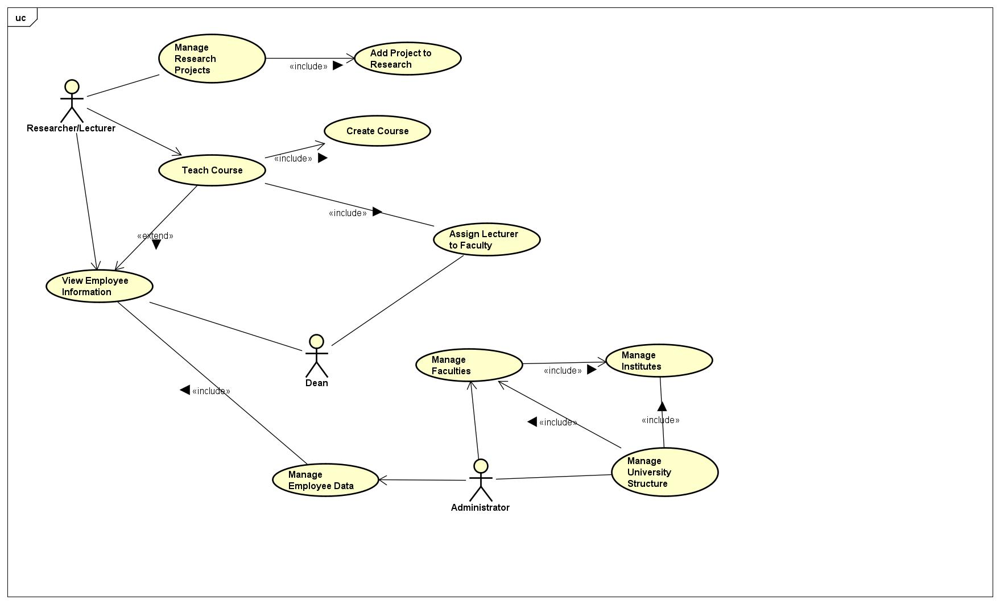
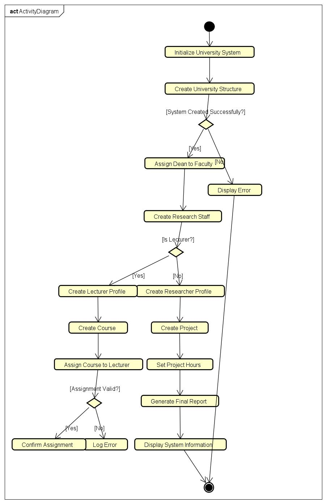

# Университетская информационная система (ЛР №10)

**Моделирование информационной системы университета с использованием UML и Java**

## 📋 Описание

Информационная система управления университетом с полным UML-моделированием и реализацией на Java. Система включает структуру университета (факультеты, кафедры), управление персоналом, курсы и исследовательские проекты.

## 📇 UML Диаграммы

### 1. Use Case Diagram

### 2. Class Diagram - Оригинальная модель

### 3. Class Diagram - Реверс-инжиниринг

Модель составляется автоматически из Java-кода в Astah Professional.

### 4. Activity Diagrams

### 5. Sequence Diagrams

#### Manage University Structure

#### Teach Course

#### Manage Research Projects

## 📁 Структура репозитория

- `src/` - исходный Java-код
- `diagrams/` - UML диаграммы
- `screenshots/` - результаты выполнения

## 🛠️ Используемые технологии

- **UML Modeling**: Astah Professional
- **Language**: Java 8+
- **IDE**: IntelliJ IDEA / Eclipse
